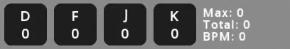
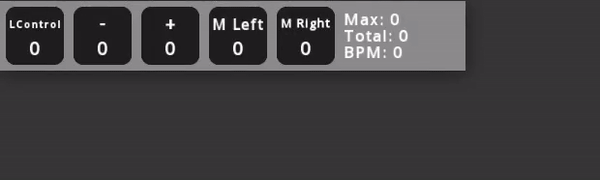
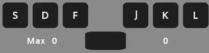
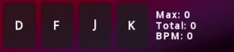
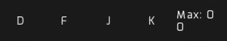
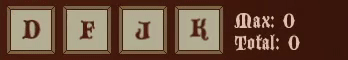
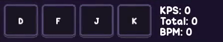
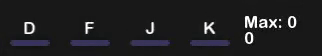
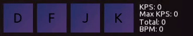
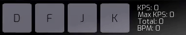

# JKPS
JKPS is a program that shows keystates, keys per second, total keys and current beats per minute. The program is intended to be used in rhythm games such as osu!, etterna, stepmania etc.

# Preview
The program when active looks like that:

# Usage
To add a keyboard key press Ctrl + "+", to add mouse button press Ctrl + ">", and to remove press Ctrl + "-".

To change a key click with right mouse button on the graphical button to open key selector, and then click the required key on the keyboard. If you want to change the text on the button, then write it in the second box.

These actions look like:

To change how the program looks press Ctrl + A to open graphical menu. If you want to change texture or font, then you have to provide it in the same folder where the program is, and then write the whole asset name (extension included) in the graphical menu, and then press Enter or Refresh button.

The program will generate a config named JKPS.cfg, that holds every parameter of the program.

Entire explanation of the config you can find [here](https://gist.github.com/JekiTheMonkey/06c7b7dc0401729c2574a04442b19225).

# Hotkeys

Click with right mouse button on the key to edit it

Ctrl + "+/-" - Add/remove keys

Ctrl + "<" - Add mouse buttons

Ctrl + W - Close the program

Ctrl + X - Reset all the statistics

Ctrl + A - Open graphical menu

Ctrl + K - Open an extra window with KPS

Alt (hold) - Show opposite button values

# Graphical menu

# Notes
- Capture the program as a game in OBS, not as a window.
- To make the program work with green screen just write in the "Background texture" parameter "GreenscreenBG.png" and press Enter or Refresh button.
- The palette in menu will not adjust own color to the parameter one.
- If you change anything in the config file, then exit the program first.
- BPM is not calculated immediately, it will be displayed correctly only after a second and 9 frames. To get the right BPM you must stream at least "BPM / 15" notes.

# [Themes](https://gist.github.com/JekiTheMonkey/727f57dcdecb76480b982f0fe479c5c1)

# Links

[Download](https://github.com/JekiTheMonkey/JKPS/releases/)

[Themes](https://gist.github.com/JekiTheMonkey/727f57dcdecb76480b982f0fe479c5c1)

# License
Licensed under the [MIT License](LICENSE).
