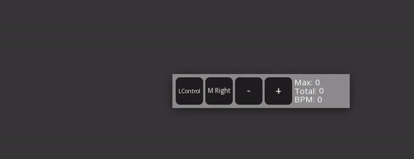
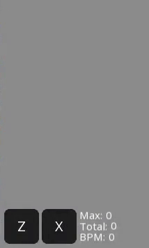

# JKPS
JKPS is a program that shows keystates, keys per second, total keys and current beats per minute. The program is intended to be used in rhythm games such as osu!, Etterna, Stepmania etc.

# Preview
The program when active looks like that:

# Usage
To add a keyboard key press **Ctrl** + **+**, to add mouse button press **Ctrl** + **>**, and to remove press **Ctrl** + **-**.

To rebind a key click with right mouse button on the button and then click the desired key on the keyboard. If you want to change key label, then write it in the second text box.

These actions look like:

To change how the program looks press **Ctrl** + **A** to open menu. If you want to change texture or font, then you have to provide it in the same directory where the program is located and then write the **whole asset name (extension included)** in corresponding text box and then press Enter or Refresh button.

# Hotkeys

Click with **right mouse button** on the button to edit it

**Ctrl** + **+/-** - Add/remove keyboard keys

**Ctrl** + **<** - Add mouse buttons

**Ctrl** + **W** - Close the program

**Ctrl** + **X** - Reset all the statistics

**Ctrl** + **A** - Open menu

**Ctrl** + **K** - Open an extra window with KPS

**Alt** (hold) - Show opposite button values

## Menu hotkeys

**Up arrow** (while a value is selected) - Increment a numeric value by 1

**Down arrow** (while a value is selected) - Decrement a numeric value by 1

**Tab** - Change cursor on next value (if there is any)

**Shift + Tab** - Change cursor on previous value (if there is any)

**Ctrl + Tab** - Forward tabulation

**Ctrl + Shift + Tab** - Backward tabulation

# Key press visualization

# Notes
- Capture the program as a game in OBS, not as a window.
- To make the program work with greenscreen write **"GreenscreenBG.png"** in **"Main window" -> "Background texture filepath"** and press Enter or Refresh button.
- If the program lags only in OBS then close its menu.
- For Linux users: [**SFML 2.5.1**](https://www.sfml-dev.org/) must be installed.

# [Themes](Wiki/Themes.md)

# Links

[Download](https://github.com/Tonetfal/JKPS/releases/)

[Themes](Wiki/Themes.md)

# License
Licensed under the [MIT License](LICENSE).
