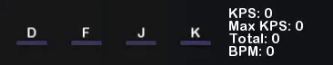

# JKPS
JKPS is a simple program that shows keystates, keys per second, total keys and current beats per minute. The program is intended to be used in rhythm games such as osu!, stepmania etc.

# Preview

It supports up to 10 keyboard keys and 5 mouse buttons. Numerical parameters and keys and be changed in-program, but the textures and fonts only in the config.

# Usage
To add or remove a keyboard key press Ctrl + "+" or "-". 

To change a key click with right mouse button on the button to select it, and then click the required key on the keyboard
These actions look like:

To change how the program looks you have to press Ctrl + A to open graphical menu.

If you want to use other font or image for anything, then you have to provide it. 

If you want to change anything in the config, that is generated in the same directory where the program is, then you must put one space between colon and 
the rest of the data. If this data are some numbers or keys, they must be separated with a comma without any extra space between. If it is a path to a 
texture or font, it must be written without any quotes, and must include the extension, such as png, jpg etc.

To know what keys and buttons can be written in the config check this [link](https://gist.github.com/JekiTheMonkey/c40b346907ca0e3e8127f4fb0b5af1d5).

Entire explanation of the config you can find [here](https://gist.github.com/JekiTheMonkey/06c7b7dc0401729c2574a04442b19225).

# Hotkeys

Click with right mouse button on the key to edit it

Ctrl + "+/-" - Add/remove keyboard keys

Ctrl + W - Close the program

Ctrl + X - Reset all the statistics

Ctrl + A - Open graphical menu

Ctrl + K - Open an extra window with KPS

Ctrl (hold) - Show opposite button values

# Graphical menu

# Extra window with KPS

# Notes
- Capture the program as a game in OBS, not as a window.
- To make the program work with green screen just change the "Background color" to 0,177,64.
- BPM is not calculated immediately, it will be displayed correctly only after a second and 9 frames. To get the right BPM you must stream at least "BPM / 15" notes.

# [Themes](https://gist.github.com/JekiTheMonkey/727f57dcdecb76480b982f0fe479c5c1)

# Links

[Download](https://github.com/JekiTheMonkey/JKPS/releases/)

[Themes](https://gist.github.com/JekiTheMonkey/727f57dcdecb76480b982f0fe479c5c1)

# License
Licensed under the [MIT License](LICENSE).
