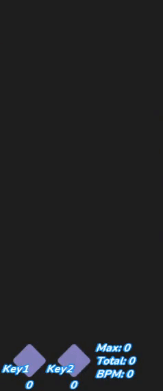
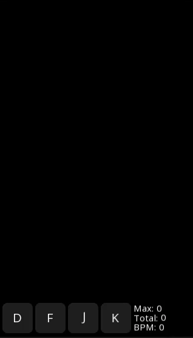
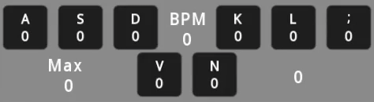
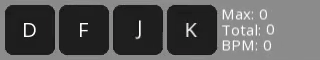
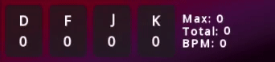
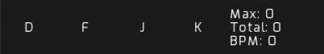
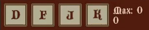

# How to install

1. Close the program if it's opened
2. Download a theme and place it in any directory you want
3. Move **ONLY** the program file in the theme directory
4. Open the program

# How to make own theme

To make your own theme you have to provide textures and fonts which you should put in the same program directory. Then set asset name and its extension in the menu (Ctrl + A). If you want to change color, size, increase spacing or whatever you wish, you have look up the menu, where all the parameters are.

# Themes

These themes may be compatible only with the newest version (v0.2), if you want to use an old program version then you should look up [here](https://www.dropbox.com/sh/198quwutazjbpza/AADUHDhlNqCA5mYhUh1D0GDZa?dl=0) for old themes.
Themes are in order from new to old (click the name to download)

# [Celestial blue](https://www.dropbox.com/sh/flhk3wfkkrprozv/AAD9N9o923M-wR3XUorQ_YYua?dl=1)

# [White-orange 2 with visualization](https://www.dropbox.com/sh/5t3uj4obbsslnhe/AAADDMnDLcMKmCaJng_R3T1qa?dl=1)

# [7k&4k mania white-orange 2](https://www.dropbox.com/sh/h49chtcu9oad2mz/AAB0xlhibL3kgeWtvj0_iL5Ca?dl=1)

# [7k mania white-orange 2](https://www.dropbox.com/sh/pia9g93ob3h2ydz/AADoV0OMtyywP5i2iYLvou2ia?dl=1)

# [ADOFAI white-orange 2](https://www.dropbox.com/sh/xsrxrafkhhmqf9i/AABgyF208tdAu7mluolD03aPa?dl=1)

# [White-orange 2](https://www.dropbox.com/sh/0wkugdeedof5qnh/AAAJO9edMXeoKRlLw_3LqHGda?dl=1)

# [Red-violet](https://www.dropbox.com/sh/xtcwnm762uf1jrr/AACDLwaT7NzYTa4X0bTwa7I6a?dl=1)

# [Dark minimalistic 2 nano](https://www.dropbox.com/sh/l0rlty6ocqivm48/AABIOik6kaPy4RFD9MFZmapNa?dl=1)

# [Dark minimalistic 2](https://www.dropbox.com/sh/rbv7bs1nzdv3pv7/AAB3zdOm8O5T2iSQEWZulZZOa?dl=1)

# [Dark minimalistic nano](https://www.dropbox.com/sh/ivabmjhai7jbnnd/AAB0NY464iQudW5pNUMRAHy5a?dl=1)

# [Dark minimalistic](https://www.dropbox.com/sh/kv6tbii4n7pzy4z/AACYqI3LUiBG9kpOBmNvyPhGa?dl=1)

# [Medieval](https://www.dropbox.com/sh/7gacclbkf277qcl/AAAi2mscYILZtGOqqtc8GGgXa?dl=1)

# [Modern purple](https://www.dropbox.com/sh/1c8lozwtlgprc80/AAB2ddxcMtl92Vv3XLbhNIAea?dl=1)

# [White-orange](https://www.dropbox.com/sh/mvclkiwjmt990m6/AABZsCw9D8PDGT08cwvXDKTWa?dl=1)

# [Dark-violet](https://www.dropbox.com/sh/kkzkxbo5x85wf7j/AAD4rssz6Uq1hAeOjHdoUaDpa?dl=1)

# [Dark classic](https://www.dropbox.com/sh/buqshi9vvcd8n0x/AADA6TiA4cv2GknTgVx1WWiYa?dl=1)

